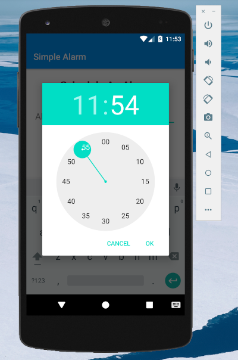

# Simple Alarm

Simple alarm it's a small and Android app writtem in java. It make use of alarm manager, pending intent and BroadcastReceiver to schedule an alarm. The alarm will be displayed as custom notification eventually and a custom tone will also be played.

Features:
- Schedule an alarm using TimePicker
- Display alarm as custom notification
- Play custom tone mp3 sound using MediaPlayer

